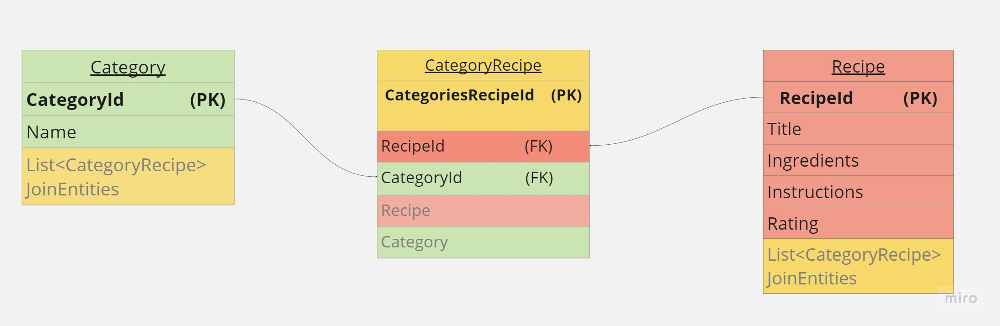

# Recipe Box

#### A C# MVC web application for storing recipes with their descriptions, ingredients, and ratings. Users may create categories to associate with their recipes.

#### By Jonathan Cheng, Paul LeTourneau, Jake Elsberry

## Technologies Used

- _C#_
- _HTML_
- _CSS_
- _Bootstrap_
- _.NET 6_
- _ASP.NET Core MVC_
- _Razor View Engine_
- _MySQL Workbench_
- _MySQL Community Server_
- _Entity Framework Core_

## Description

- _This app was an exploration in using authentication and authorization for our MVC web applications. We use Identity to handle user authentication -- registering, logging in and out. We added roles for user accounts. Only logged in users may access the create, update, and delete aspects for recipe and category classes._
- _Technical Details:_

  - _This web application was written using C#, run using .NET framework, its ability to run in a browser enabled using the ASP.NET Core MVC framework, and database query and relationships handled using Entity Framework Core._
  - _Utilizes a many-to-many relationship between the two classes -- category and recipe._
  - _Data annotations and conditionals are in place to validate user input._
  - _Full CRUD functionality works for both classes._
  - _Styling uses CSS and Bootstrap._
  - _Data storage is managed using MySQL. Entity Framework Core .NET Command-line Tools (or dotnet ef) is used for database version control -- migrations are created to tell MySQL how the database is structured and updated as needed._

- _Below: Schema showing the many-to-many database relationship._
<p align="center">

</p>

## Setup/Installation Requirements

### Required Technology

- _Verify that you have the required technology installed for MySQL (https://dev.mysql.com/doc/mysql-installation-excerpt/5.7/en/) and MySQL Workbench (https://dev.mysql.com/doc/workbench/en/)._
- _Also check that Entity Framework Core's `dotnet-ef` tool is installed on your system so that it can perform database migrations and updates. Run the following command in your terminal:_
  > ```bash
  > $ dotnet tool install --global dotnet-ef --version 6.0.0
  > ```

### Setting Up the Project

_1. Open your terminal (e.g., Terminal or GitBash)._

_2. Navigate to where you want to place the cloned directory._

_3. Clone the repository from the GitHub link by entering in this command:_

> ```bash
> $ git clone https://github.com/joncheng-dev/RecipeBox
> ```

_4. Navigate to the project's production directory `RecipeBox`, and create a new file called `appsettings.json`._

_5. Within `appsettings.json`, add the following code, replacing the `uid`, and `pwd` values with your username and password for MySQL. Under `database`, add any name that you deem fit -- although `recipe_box_db` is suggested for organization sake and clarity of purpose._

```json
{
  "ConnectionStrings": {
    "DefaultConnection": "Server=localhost;Port=3306;database=[YOUR-DATABASE-NAME-HERE];uid=[YOUR-USERNAME-HERE];pwd=[YOUR-PASSWORD-HERE];"
  }
}
```

_6. In the terminal, while in the project's production directory `RecipeBox`, run the following command. It will utilize the repository's migrations to create and update the database. You may opt to verify that the database has been created successfully in MySQL Workbench._

> ```bash
> $ dotnet ef database update
> ```

## Running the Project

- _In the command line, while in the project's production directory `RecipeBox`, run this command to compile and execute the web application. A new browser window should open, allowing you to interact with it._

> ```bash
> $ dotnet watch run
> ```

- _Alternatively, using the command `dotnet run` will execute the application. Manually open a browser window and navigate to the application url (ex: `https://localhost:5001` or `http://localhost:5000`)_

> ```bash
> $ dotnet run
> ```

- _Optionally, to compile this web app without running it, enter:_

> ```bash
> $ dotnet build
> ```

## Known Bugs

- _Index view of role controller currently doesn't display users that belong to a given role._

## License

MIT License

Permission is hereby granted, free of charge, to any person obtaining a copy of this software and associated documentation files (the "Software"), to deal in the Software without restriction, including without limitation the rights to use, copy, modify, merge, publish, distribute, sublicense, and/or sell copies of the Software, and to permit persons to whom the Software is furnished to do so, subject to the following conditions:

The above copyright notice and this permission notice shall be included in all copies or substantial portions of the Software.

THE SOFTWARE IS PROVIDED "AS IS", WITHOUT WARRANTY OF ANY KIND, EXPRESS OR IMPLIED, INCLUDING BUT NOT LIMITED TO THE WARRANTIES OF MERCHANTABILITY, FITNESS FOR A PARTICULAR PURPOSE AND NONINFRINGEMENT. IN NO EVENT SHALL THE AUTHORS OR COPYRIGHT HOLDERS BE LIABLE FOR ANY CLAIM, DAMAGES OR OTHER LIABILITY, WHETHER IN AN ACTION OF CONTRACT, TORT OR OTHERWISE, ARISING FROM, OUT OF OR IN CONNECTION WITH THE SOFTWARE OR THE USE OR OTHER DEALINGS IN THE SOFTWARE.

Copyright (c) _2023_ _Jonathan Cheng,_ _Paul LeTourneau,_ _Jake Elsberry_
